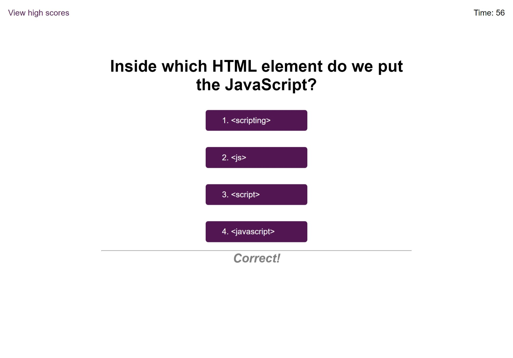
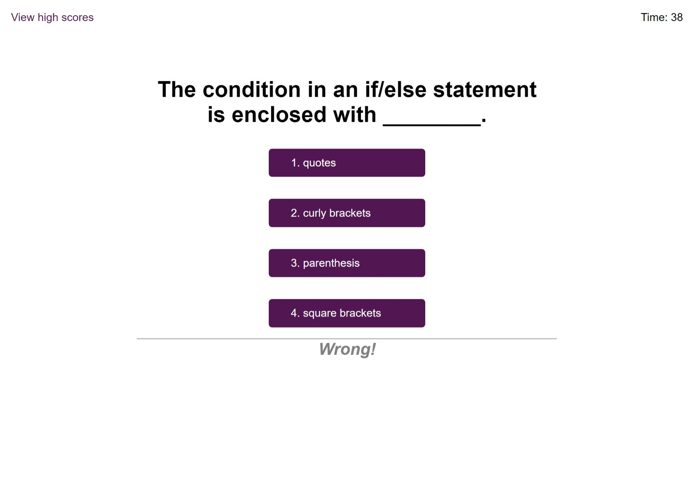
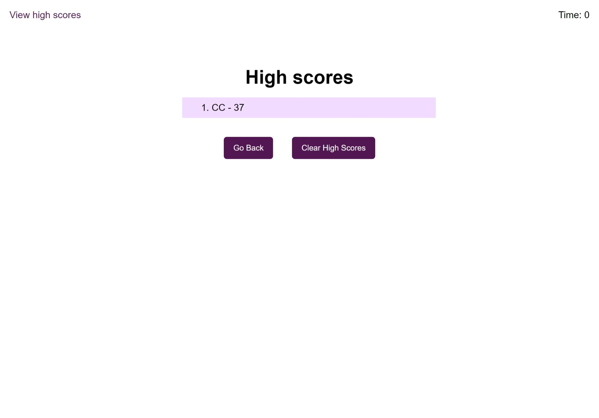

<!-- omit in toc -->
# jQuery Coding Quiz

<!-- omit in toc -->
## Description

This is a timed coding quiz app with multiple choice questions made using jQuery.
When player clicks the start button, a timer will start counting down and a series of multiple choice questions will be presented one at a time. Incorrect answers will penalize time, and when all questions are answered or the timer reaches 0, the game will be over and let player save initials and scores and show high scores that have been saved.
 
 
You can check out the deployed application from the link below:
 
[https://clairehwcho.github.io/jquery-coding-quiz/](https://clairehwcho.github.io/jquery-coding-quiz/)

<!-- omit in toc -->
## Table of Contents
- [Installation](#installation)
- [Screenshots](#screenshots)
- [License](#license)

## Installation

No special requirements.

## Screenshots

- Index page

- Question correctly answered

- Question incorrectly answered

- Save initials and scores after game is over

- View high scores

- After clearing high scores

## License
Copyright © 2022 [Claire Cho](https://github.com/clairehwcho).